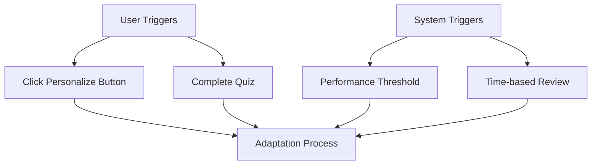
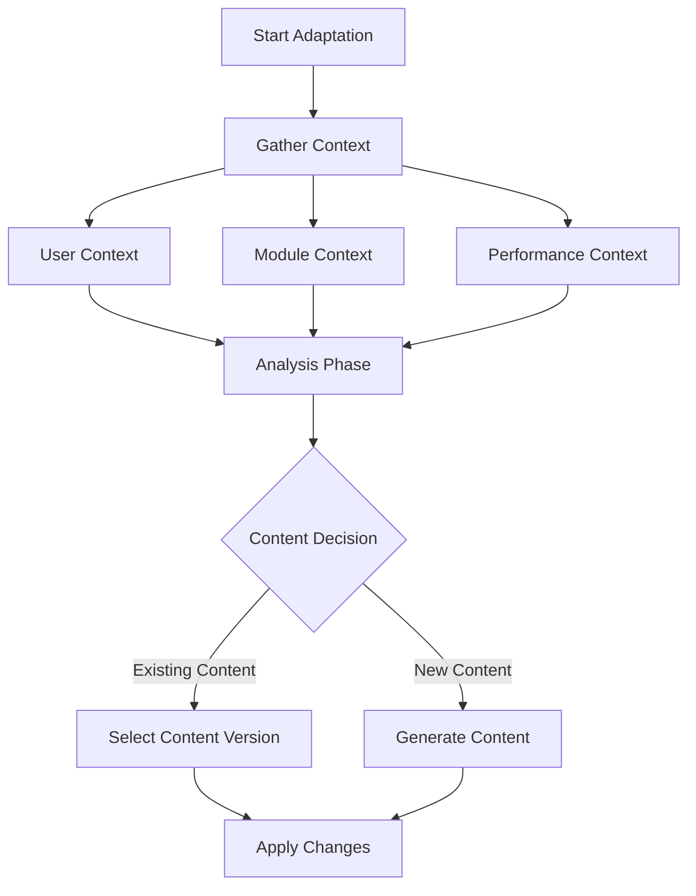
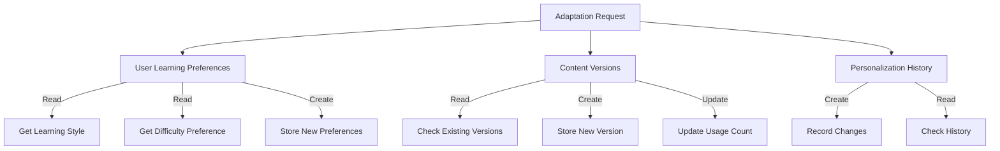
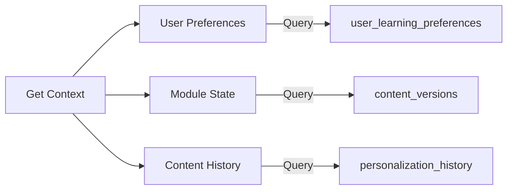
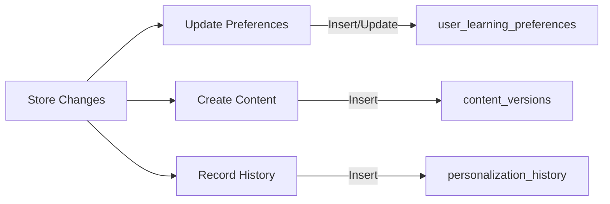
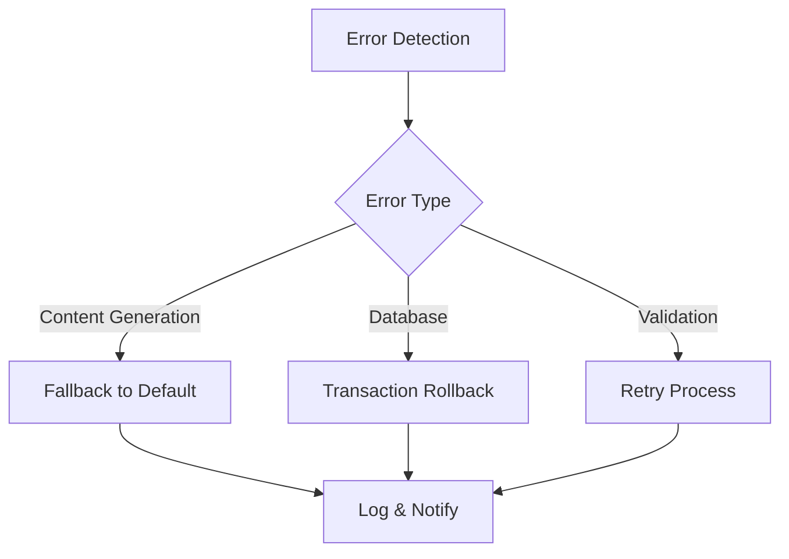
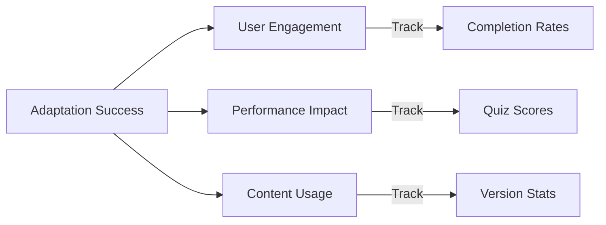

# Content Adaptation Flow

## 1. Trigger Points


## 2. Adaptation Process Flow


## 3. Data Flow & Entity Interactions


## 4. Database Operations Flow

### 4.1 Read Operations


### 4.2 Write Operations


## 5. Detailed Process Steps

1. **Trigger Detection**
   - User clicks personalize button
   - Quiz completion triggers adaptation
   - System detects performance threshold
   - Scheduled review time reached

2. **Context Gathering**
   ```
   User Context
   ├── Learning preferences
   ├── Performance history
   ├── Engagement metrics
   └── Technical background

   Module Context
   ├── Current progress
   ├── Unit relationships
   ├── Learning objectives
   └── Content dependencies

   Performance Context
   ├── Quiz scores
   ├── Completion times
   ├── Engagement rates
   └── Difficulty levels
   ```

3. **Analysis & Decision**
   ```
   Content Decision Tree
   ├── Check existing versions
   │   ├── Match found → Select version
   │   └── No match → Generate new
   │
   ├── Generate new content
   │   ├── Define parameters
   │   ├── Call AI service
   │   └── Validate output
   │
   └── Update relationships
       ├── Link to unit
       ├── Update preferences
       └── Record history
   ```

4. **Database Operations**
   ```
   Sequential Operations
   ├── Read current state
   │   ├── Get user preferences
   │   ├── Get content versions
   │   └── Get personalization history
   │
   ├── Process adaptation
   │   ├── Select/Generate content
   │   ├── Update preferences
   │   └── Create history record
   │
   └── Verify changes
       ├── Check content validity
       ├── Verify relationships
       └── Update usage metrics
   ```

## 6. Error Handling & Recovery


## 7. Success Metrics

