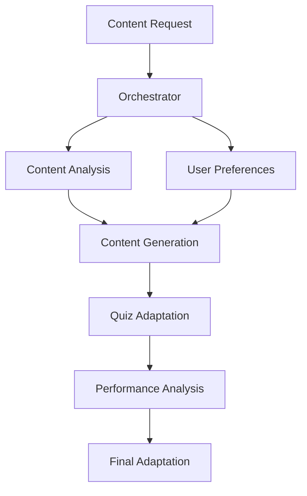

I'll help design the AI agent architecture for content adaptation using sequential thinking. Let me break this down step by step.

Based on the sequential thinking process, I've designed a comprehensive AI agent architecture for the content adaptation feature. Here's a detailed breakdown:

## 1. Technology Stack

### Core Framework
- **LangChain.js** for agent orchestration
- **Gemini Pro** as the primary LLM
- **Pinecone** for vector embeddings
- **PostgreSQL** for structured data
- **Redis** for caching and queues
- **BullMQ** for background processing

### Key Libraries
- `@langchain/core` & `@langchain/google-genai`
- `@pinecone-database/pinecone`
- `drizzle-orm`
- `natural` for NLP
- `readable` for text analysis
- `zod` for validation

## 2. Agent Architecture

### 2.1 Content Analysis Agent
- Analyzes content complexity
- Classifies learning styles
- Evaluates content structure
- Scores readability
- Generates content embeddings

### 2.2 User Preference Agent
- Extracts learning style preferences
- Analyzes performance patterns
- Calculates engagement metrics
- Aggregates historical data

### 2.3 Content Generation Agent
- Transforms content style
- Rewrites content based on preferences
- Generates examples
- Creates interactive elements

### 2.4 Quiz Adaptation Agent
- Analyzes question difficulty
- Selects appropriate question types
- Generates distractors
- Estimates completion time

### 2.5 Performance Analysis Agent
- Analyzes scores
- Tracks progress
- Calculates engagement
- Generates recommendations

## 3. Data Flow



## 4. Implementation Example

```typescript
// Core orchestrator
class AdaptationOrchestrator {
  private agents: AgentHub;
  private vectorStore: ContentVectorStore;
  private queue: Queue;

  async orchestrate(context: AdaptationContext): Promise<AdaptationResult> {
    // 1. Initialize context
    const session = await this.createAdaptationSession(context);

    // 2. Run analysis
    const contentAnalysis = await this.agents.content.analyze(context.content);
    const userPreferences = await this.agents.preference.extract(context.userId);

    // 3. Generate adaptations
    const adaptedContent = await this.agents.generation.generate({
      original: context.content,
      analysis: contentAnalysis,
      preferences: userPreferences
    });

    // 4. Adapt assessments
    const adaptedQuiz = await this.agents.quiz.adapt({
      original: context.quiz,
      preferences: userPreferences
    });

    // 5. Store results
    return this.storeAndFinalize(session, {
      content: adaptedContent,
      quiz: adaptedQuiz
    });
  }
}
```

## 5. Key Features

1. **Modular Design**
   - Independent agents with specific responsibilities
   - Easy to extend and maintain
   - Testable components

2. **Scalable Processing**
   - Background job processing
   - Caching layer
   - Distributed task queue

3. **Smart Content Management**
   - Vector similarity search
   - Version control
   - Content embeddings

4. **Real-time Adaptation**
   - WebSocket updates
   - Progressive enhancement
   - Immediate feedback

## 6. Integration with Existing System

```typescript
// API Route
export async function POST(req: Request) {
  const { userId, unitId, adaptationType } = await req.json();

  const orchestrator = new AdaptationOrchestrator();

  // Queue the adaptation job
  const job = await adaptationQueue.add('adapt-content', {
    userId,
    unitId,
    adaptationType
  });

  // Return job ID for tracking
  return Response.json({ jobId: job.id });
}

// WebSocket updates
websocket.on('adaptation-progress', (jobId) => {
  const progress = await adaptationQueue.getJob(jobId).progress();
  ws.send(JSON.stringify({ jobId, progress }));
});
```

This architecture aligns with your existing features and provides a robust foundation for content adaptation. Would you like me to elaborate on any specific component or provide more implementation details?
